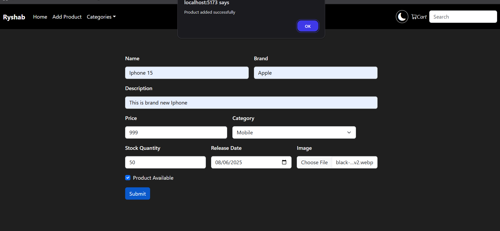
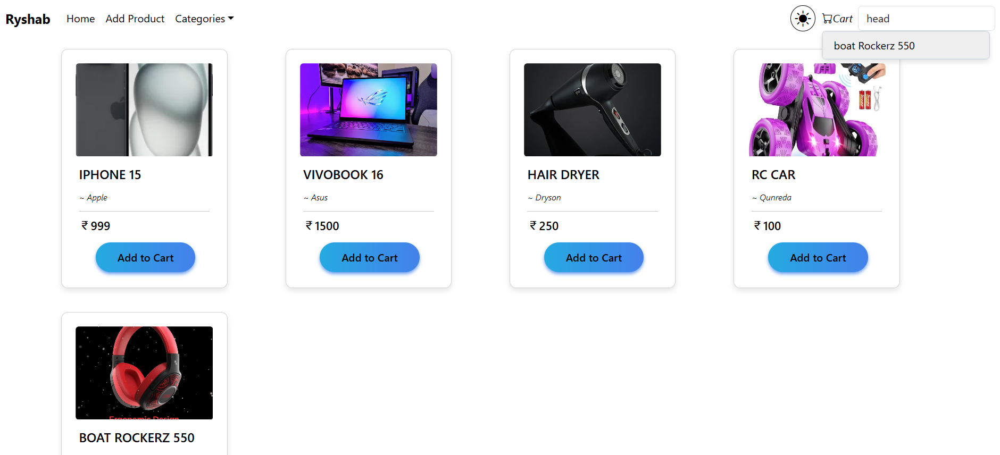
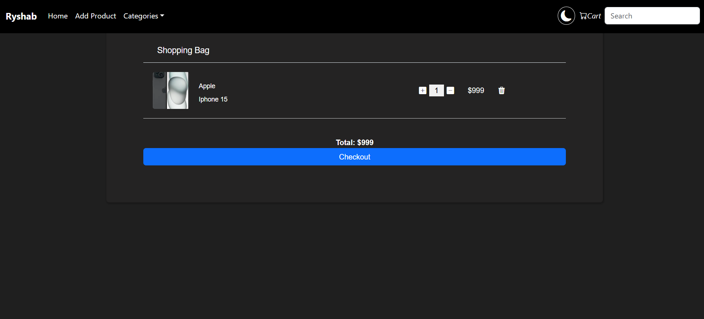
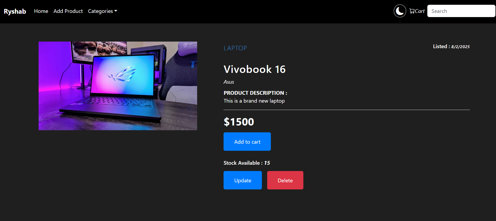

@@ -1,222 +1,222 @@

# ClipFart — E‑commerce Showcase (Spring Boot + React + MySQL)

A portfolio project demonstrating a full‑stack e‑commerce workflow: product browsing, search, CRUD, and a working shopping cart. Built with a clean Model–Service–Controller architecture on the backend and a modern React UI on the frontend. Not intended for production deployment; optimized for code review and local runs by potential employers.

## Features

- Home catalog with cards for all products (image, name, brand, price)

- Full‑text SearchBar across name, description, brand, and category

- Product details page with “listed on” date, stock, price, and image

- Admin-style CRUD: add, update, and delete products

- Shopping cart drawer/page with quantity increment/decrement and totals

- Categories filter menu

- Light/Dark friendly styling (see screenshots)

- Robust validation and error handling

- Layered backend: Controller → Service → Repository (JPA)

## Tech Stack

- Backend: Java 17+, Spring Boot 3+, Spring Web, Spring Data JPA, Validation

- Database: MySQL 8

- Frontend: React + Vite, TypeScript/JavaScript, Axios, React Router

- Build/Tools: Maven, npm

- API Tools : Postman

## Architecture Overview

- Domain: Product entity (id, name, brand, description, price, category, stockQty, listedAt, imageUrl, available)

- Controller layer exposes REST endpoints under /api/v1/products

- Service layer encapsulates business logic, validation, and mappings

- Repository layer uses Spring Data JPA for persistence and search

- DTOs for request/response (to keep entities clean)

- Global exception handling via @ControllerAdvice and problem-details

## Screenshots

- Add Product form with validation and success toast

&nbsp;	

- Home grid with product cards and working search dropdown

- Cart page with quantity controls and computed total

- Product detail page with update/delete actions and listed date

## Getting Started

Prerequisites

- Java 17+

- Maven 3.9+

- Node.js 18+

- MySQL 8 running locally

### 2) Frontend (React)

- cd frontend

- npm install

- npm run dev

- App runs at http://localhost:5173

## Search Behavior

- SearchBar queries name, description, brand, category (case‑insensitive)

- Backend provides LIKE-based filtering endpoint (q param)

- Frontend debounces input and shows suggestions

## Cart Behavior

- Add to cart from card or product detail

- Increment/decrement quantity and remove line

- Calculates subtotal and total

- Cart stored in client state (and localStorage for persistence)

Run:

- ./mvnw test

## How To Review (For Employers)

- Start backend on 8080 and frontend on 5173

- Use “Add Product” to create a product with image URL; confirm toast

- Use SearchBar to find by brand or category keywords

- Open any product to view “listed on” date; try update and delete

- Add items to cart, adjust quantities, and verify totals

## Possible Improvements

- Authentication/authorization (admin vs shopper)

- Pagination, sorting, and price range filters

- Image upload to S3/Cloudinary instead of URL input

- Server‑side caching and ETags

- Testcontainers for integration tests

- CI pipeline and static analysis (SpotBugs/Checkstyle)

- Internationalization and currency formatting utilities

## Project Status

- Purpose: demonstration only; not hardened for production

- Environment: local setup with MySQL

- Security: open endpoints for easier review

## Author
Rishabh Yadav — B.Sc Computer Science (University of Delhi).

Building portfolio projects with Spring Boot, React, and MySQL.

